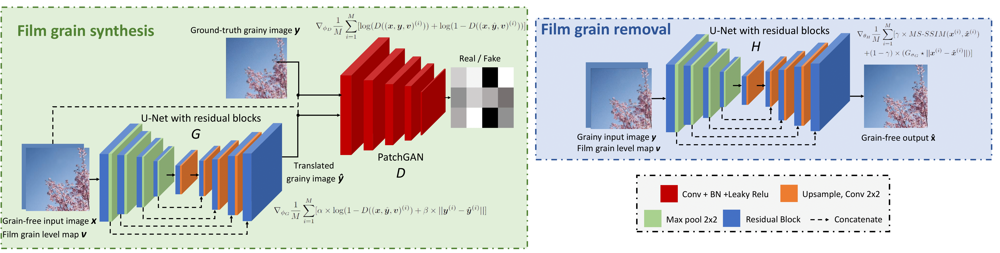

# Deep-based film grain removal and synthesis
Zoubida Ameur, Wassim Hamidouche, Edouard François, Milos Radosavljevic, Daniel Ménard and Claire-Hélène Demarty


## Abstract

In this paper, deep learning-based techniques for film grain removal and synthesis that can be applied in video coding are proposed. Film grain is inherent in analog film content because of the physical process of capturing images and video on
film. It can also be present in digital content where it is purposely added to reflect the era of analog film and to evoke certain emotions in the viewer or enhance the perceived quality. In the context of video coding, the random nature of film grain makes
it both difficult to preserve and very expensive to compress. To better preserve it while compressing the content efficiently, film grain is removed and modeled before video encoding and then restored after video decoding. In this paper, a film grain removal model based on an encoder-decoder architecture and a film grain
synthesis model based on a conditional generative adversarial network (cGAN) are proposed. Both models are trained on a large
dataset of pairs of clean (grain-free) and grainy images. Quantitative and qualitative evaluations of the developed solutions were conducted and showed that the proposed film grain removal
model is effective in filtering film grain at different intensity levels using two configurations: 1) a non-blind configuration where the film grain level of the grainy input is known and provided as input, 2) a blind configuration where the film grain level is
unknown. As for the film grain synthesis task, the experimental results show that the proposed model is able to reproduce realistic film grain with a controllable intensity level specified as input.


## Network architecture




## Structure of the repository
- `environment.yml`: conda environment specifications and required packages 
- `src`: 
	- `data.py`: data loader
	- `model.py`: models builder
	- `utils.py`: utility functions
	- `losses.py`: loss functions 
	- `train.py`: training loops.
	- `main.py`: script for training
	- `test.py`: script for evaluating a trained model on a test dataset
	- `test_one.py`: script for evaluating a trained model on a single test image
	- `config.json`: training parameters

File config.json contains the following training parameters:
```

{
"epochs" : 5,
"batch_size" : 1,
"input_dim" : 256,
"learning_rate_alpha_gen" : 3e-4,
"learning_rate_alpha_dis" : 1e-4,
"learning_rate_beta_gen" : 0.5,
"levels" : [0.01,0.025,0.05,0.075,0.1]
}

```


## Structure of the associated FilmGrain dataset

In this paper, we also provide a FilmGrain dataset that is available at the address:
https://www.interdigital.com/data_sets/filmgrain-dataset

The structure of the dataset is the following:

```
    FilmGrainDataset
    ├── org				
    └── fg             
        ├── 01     
        ├── 025              
        ├── 05         
        ├── 075          
        └── 1     
```

Subfolder org contains original images without film grain. Subfolder fg contains images with grain.

<a name="Getting started"></a>
## 1. Getting started

Clone the repository

```bash
git clone https://github.com/InterDigitalInc/DeepFilmGrain.git
cd DeepFilmGrain/
```

Create and activate a conda environment with required packages: 
```bash
conda env create --name example-environment --file environment.yml
conda activate example-environment
```

## 2.Finding a free gpu node

When running on gpu, you'll have to explicitly name the node on which you want to launch your command. To see free nodes, under linux, type:
```bash
nvidia-smi 
```


## 3.Testing


### On a test dataset

To test on one folder of test images, run the following (assuming gpu node#2 is free):
```bash
CUDA_VISIBLE_DEVICES=2 python3 src/test.py --pretrained_model path/to/pretrained/model/model.h5 --level 0.01 --input_path path/to/input/folder/ --output_path path/to/output/folder/
```
| Option          | Description                                                |                                                                                                     
|-----------------|------------------------------------------------------------|
| --pretrained_model         | path to pretrained model|                                                                          
| --level 	  	  | film grain levels {0.01, 0.025, 0.05, 0.075, 0.1}	| 
| --input_path    | path to input folder
| --output_path   | path to output folder 

When testing on the FilmGrain dataset: 
* if the model was trained for removing grain, use subfolder fg (samples with grain) as input; 
* if the model was trained to synthesize grain, use subfolder org (samples without grain) as input.

### On one test image with different film grain patterns
To test on a single image, run the following (same options as above and assuming gpu node#2 is free):

```bash 
CUDA_VISIBLE_DEVICES=2 python3 src/test_one.py --pretrained_model path/to/pretrained/model/model.h5 --level 0.1 --input_path path/to/input/image --output_path path/to/output/folder/
```

## 4. Training
### On GPU  
An example command is (assuming gpu node#2 is free):
```bash
CUDA_VISIBLE_DEVICES=2 python3 src/main.py --path path/to/dataset/ --task removal_case_1
```


| Option          | Description                                                | Usage                                                                                                     |
|-----------------|------------------------------------------------------------|-----------------------------------------------------------------------------------------------------------|
| --path          | path of the custom dataset                                 | Path to the dataset to be used for training                         |
| --task          | task you want to learn                             	   	   | Task and case of the ablation study, described below.                                                                                          |

The different configurations considered in the ablation study are the following: 

| Tasks | Inputs 								| Backbone | Loss functions |
|-------|---------------------------------------|----------|----------------|
| removal_case_1  | grainy image |U-Net 	   |	 l1 		|
| removal_case_2  | grainy image   |U-Net + residual blocks | l1 |
| removal_case_3  | grainy image   |U-Net + residual blocks | l1 + MS-SSIM |
| removal_case_4 	| grainy image    						|U-Net + residual blocks | l1 + MS-SSIM |
| synthesis_case_1  | clean image 	   |U-Net 	   |	 l1 		|
| synthesis_case_2  | clean image     |U-Net + residual blocks | l1 |
| synthesis_case_3  | clean image    |U-Net + residual blocks + PatchGAN | l1 + adv loss |

PS : synthesis_case_3_gray, removal_case_3_gray, removal_case_4_gray are the grayscale versions.

### Train on the FilmGrain dataset
```bash
CUDA_VISIBLE_DEVICES=2 python3 src/main.py --path path/to/FilmGrain/dataset/ --task synthesis_case_1
```

### Train on your dataset
If you want to train on your own dataset, use the option –-path to set the dataset path and set the folder tree as follows:

```
    dataset
    ├── org				
    ├── fg             
    │   ├── level1     
    │   ├── level2              
    │   ├── ...         
    │   ├── ...          
    └── └── leveln                   
```

level1, level2, ..., leveln are the different film grain intensity levels.


## Citation
```
@article{ameur2022deep,
  title={Deep-based Film Grain Removal and Synthesis},
  author={Ameur, Zoubida and Hamidouche, Wassim and Fran{\c{c}}ois, Edouard and Radosavljevi{\'c}, Milo{\v{s}} and M{\'e}nard, Daniel and Demarty, Claire-H{\'e}l{\`e}ne},
  journal={arXiv preprint arXiv:2206.07411},
  year={2022}
}
```
## License 
Copyright © 2022, InterDigital R&D France. All rights reserved.
This source code is made available under the license found in the license.txt in the root directory of this source tree.
